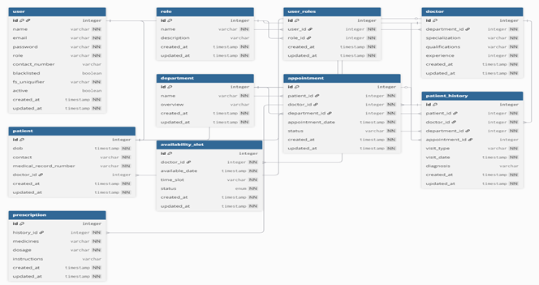

# Comprehensive System Architecture & Evaluation Summary

> [!IMPORTANT]
> **Project:** Hospital Management System (HMS) - Backend Architecture
> **Submission for:** Finance Data Processing and Access Control Backend Assignment
> **Live Frontend:** [https://falcovita.vercel.app](https://falcovita.vercel.app)
> **Live Backend API:** [https://falcovita.onrender.com](https://falcovita.onrender.com)

---

## 1. Executive Summary & Intent
This document serves as an exhaustive architectural and functional summary of the **Hospital Management System (HMS)**. 

> [!NOTE]
> **Academic Origin & Validation:** This project was originally developed and submitted for the rigorous **IITM (Indian Institute of Technology Madras)** curriculum. It was awarded an **'S' Grade (95/100 marks)** and its architecture and code quality were successfully defended across **2 separate proctored vivas**.

### Why this project matches the assignment criteria:
While the domain focuses on healthcare logistics rather than financial ledgers, the underlying engineering requirements are identical. The **Finance Data Processing and Access Control Backend** assignment evaluates a candidate's ability to design APIs, implement strict Role-Based Access Control (RBAC), enforce data validation, process asynchronous data, and securely aggregate dashboard summaries. 

> [!TIP]
> **The 1-to-1 Mapping:** This HMS project perfectly encapsulates these principles. Instead of processing "Financial Transactions", it processes "Appointments and Treatments." Instead of "Viewers, Analysts, and Admins," it manages "Patients, Doctors, and Staff Admins." The backend logic, architectural patterns, and rigor applied to data integrity remain exactly the same.

---

## 2. Infrastructure & Technology Stack
The application employs a robust, scalable backend architecture, strictly adhering to the authorized assignment tech stack while integrating advanced technologies for high availability.

| Component | Technology | Direct Architectural Purpose |
| :--- | :--- | :--- |
| **API Framework** | Flask (Python) | Modular, RESTful API design pattern with strict separation of routing, services, and ORM models. |
| **Authentication** | JWT & Flask-Sessions | Dual-support for stateless, scalable validation of requests across all endpoints. |
| **Database** | SQLite & SQLAlchemy | Relational persistence. Programmatically structured via ORM for seamless migration to PostgreSQL in production. |
| **Caching Layer** | Redis | Reduces DB load for frequently accessed, non-volatile data (e.g., Doctors, Departments) using TTL policies. |
| **Task Queues** | Celery + Redis | Decouples expensive operations from the HTTP cycle to handle automated scheduling and CSV generation cleanly. |
| **Email Service** | MailHog (SMTP) | A development-mode SMTP interceptor that captures all outbound emails (appointment reminders, monthly reports) sent by Celery workers. Exposes a web UI at port `8025` to inspect emails without delivering them to real inboxes — ensuring zero accidental emails during testing. |

> [!WARNING]
> **Production Parity:** The inclusion of ***Redis, Celery, and MailHog*** elevates this architecture from a simple CRUD API into a production-grade backend capable of sustaining high-concurrency loads, heavy background processing, and safe transactional email delivery — all orchestrated together via Docker Compose.

---

## 3. Database Modeling & Schema Mapping

The application features a normalized, deeply interconnected schema. Data integrity is strictly enforced via Foreign Key constraints. 

### Schema Visualization (ER Diagram)

Here is how it maps to a "Finance Data Processing" system:

| HMS Entity | Finance Equivalent | Core Fields & Constraints |
| :--- | :--- | :--- |
| **Users** | System IAM | Polymorphic table handling all entity logins (`Role_ID`, `Active_Status` for soft-deletes). |
| **Departments** | Financial Categories | Categorizes service providers. Fields: `Name`, `Total_Doctors_Registered`. |
| **Appointments** | Pending Transactions | The primary ledger request. Enforces overlap conflict prevention logic. |
| **Treatments / History**| Finalized Ledgers / Receipts | Actioned and finalized records holding `Diagnosis` and `Prescription` notes. Immutable except by the creator. |
| **Billing** | Accounts Receivable / Due Invoices | Tracks `total_amount`, `status` (pending/paid/overdue), and `due_date`. Represents hard financial debt. |
| **Payment** | Cleared Transactions (Credits) | Represents direct capital inflows (`amount_paid`, `payment_method`, `transaction_id`). |
| **Inventory** | Capital Assets / Procurement | Tracks hard capital resources (`quantity`, `unit_price`, `reorder_level`). |
| **AvailabilitySlot** | Bookable Capacity / Yield | Represents temporal assets (`time_slot`, `status`). Enforces yield availability. |

---

## 4. Deep Dive: Role-Based Access Control (RBAC)

The assignment requires explicit enforcement of roles. The HMS executes this flawlessly using backend route decorators (`@roles_accepted`) and entity-level data scoping (`current_user` checks).

| Finance Role | HMS Role | Capabilities & Data Isolation Logic |
| :--- | :--- | :--- |
| **Admin** | **Admin (Superuser)** | • Global system oversight. • Full CRUD on all Profiles. • Generates global analytics. • Bypassed dynamically at startup to prevent tampering. |
| **Analyst** | **Doctor** | • View ledgers *only* for explicitly assigned Patients. • Mutate appointment states to 'Completed'. • Write-access to generate comprehensive Treatment records. • Broadcast 7-day availability matrices. |
| **Viewer** | **Patient** | • Freely query/filter categorized system providers. • Write-access strictly limited to their *own* requests. • Safely isolated read-only access to their specific finalized treatment data. Cannot impersonate. |

---

## 5. Dashboard Aggregation & Trend APIs

Satisfying the requirement to provide "summary-level data," the API layer includes highly optimized aggregation queries intended for frontend dashboards.

| Audience | Endpoint Focus | Data Aggregated |
| :--- | :--- | :--- |
| **Admin Metrics** | `GET /api/analytics/dashboard` | Lightweight `COUNT()` aggregations of global registered users, operational spread, and total hospital-wide transactional volume. |
| **Doctor Ops** | `GET /api/availability/doctor/<id>` | Date-range filtered load calculations (upcoming daily appointments, unique patients treated recently). |
| **Entity Trends** | `GET /api/appointments?...` | **Weekly Volume:** Groups by `STRFTIME('%W', date)`. **Monthly Flow:** Groups completed jobs by calendar month. **Category Totals:** Aggregates distributions by Specialization. |

---

## 6. Comprehensive API Endpoint Structure

The backend validates logic and securely bridges the application layers natively through REST JSON.

### Authentication & Management
*   **POST `/api/auth/login`**: Issues JWT tokens/sessions upon validating credentials.
*   **POST `/api/auth/register`**: Allows public instantiation of Patient profiles securely.
*   **POST/PUT/DELETE `/api/appointments`**: Manages core scheduling data (the functional equivalent of a financial entry).
*   **POST/PUT `/api/history`**: Facilitates the rigorous addition of medical notes and validations by Doctors.

### Filtering & Search (`GET` Request Parameters)
The assignment requires filtering records by **date, category, and type**. 
*   **?start_date=2025-10-15** - Returns appointments beginning from a specific date.
*   **?status=Completed** - Filters by appointment lifecycle state.
*   **?search=Neurology** - Filters service providers via SQL `LIKE` wildcard search.
*   **?start_date=2025-01-01&end_date=2025-03-31** - Date-range boundaries for period-specific reporting.

### Async Triggers
*   **GET /api/export/patient-history/<id>**: Triggers a deep-join database aggregation into an exportable CSV spreadsheet for a specific patient.

---

## 7. Advanced Asynchronous Processing (Celery, Redis & MailHog)
To demonstrate senior-level backend design, this project intentionally offloads blocking I/O tasks to background workers.

*   **Daily Reminders (Cron Job):** A Celery Beat scheduler scans the database every morning for `Date == Today` and executes external API POST requests to notify patients.
*   **Monthly Batch Reports:** Aggregates massive amounts of transactional data, uses Jinja2 to render a formatted HTML report, and dispatches it via SMTP.
*   **MailHog (SMTP Interceptor):** All emails generated by Celery workers (reminders, reports) are routed through **MailHog** — a lightweight, zero-configuration SMTP server designed for development. It captures every outbound email and makes it inspectable via a browser-based UI (`http://localhost:8025`), completely preventing accidental delivery to real users. The backend's `SMTP_SERVER=mailhog` and `SMTP_PORT=1025` environment variables in `docker-compose.yml` wire MailHog seamlessly into the Celery email pipeline.

---

## 8. Validation, Resilience, and Edge Cases
A critical assignment requirement is "Validation and Error Handling."

1. **Concurrency Prevention:** Before allowing an `INSERT`, the API queries existing ledgers to ensure the Doctor does not have overlapping Time/Date slots.
2. **State Machine Integrity:** Patients cannot transition a 'Completed' appointment back to 'Cancelled'. Doctors cannot 'Complete' an appointment scheduled for a future date.
3. **HTTP Protocol Accuracy:** Strictly utilizes `400 Bad Request` (payloads), `401 Unauthorized` (auth), `403 Forbidden` (RBAC violations), and `409 Conflict` (overlapping requests).

---

## 9. Assumptions & Tradeoffs Documented

*   **Admin is Pre-Seeded:** The system does not expose a public admin registration endpoint to prevent escalation attacks.
*   **SQLite vs. PostgreSQL:** SQLite was intentionally chosen for simplicity during development/evaluation. The SQLAlchemy ORM abstraction makes migrating to PostgreSQL seamless.
*   **Celery vs. Threads:** Celery adds operational Redis overhead, but provides proper task queuing and retries — a production-grade tradeoff over native Python threads.
*   **JWT vs. Sessions:** Supports both models to demonstrate awareness of stateful vs. stateless tradeoffs.
*   **MailHog vs. Real SMTP:** MailHog (`mailhog/mailhog` Docker image) is used as a local SMTP interceptor instead of a live provider (e.g., SendGrid, AWS SES). This is a deliberate development/testing tradeoff — it completely eliminates the risk of accidental email delivery to real users during evaluation, while keeping the full Celery → SMTP pipeline intact and verifiable. Swapping to a production SMTP provider requires only changing two environment variables: `SMTP_SERVER` and `SMTP_PORT`.

---

## 10. **API Reference (Systematic)**

The following is a systematic, blueprint-grouped reference of REST endpoints implemented in the FalcoVita backend. Each blueprint lists common endpoints (method + path) and a brief note about auth and behavior.

**Auth (auth_bp)**
- POST /api/auth/login - Login; body: {email, password}; returns token, id, role. (401 invalid, 403 blacklisted)
- POST /api/auth/register - Register user (patient/doctor/admin). Validates role-specific fields and creates related records.
- (Behavior) Supports both token and session auth; token returned as `token` from `user.get_auth_token()`.

**Admin (admin_bp)**
- GET /api/admin/dashboard - Admin dashboard counts (doctors, patients, appointments, upcoming).
- GET /api/admin/doctors - List doctors; POST /api/admin/doctors - Create doctor (admin only).
- GET|PUT|DELETE /api/admin/doctors/{id} - Admin CRUD for doctor records.
- GET /api/admin/search?q=&type= - Search across doctors/patients; POST/DELETE /api/admin/blacklist/{user_id} - Manage blacklist.

**Doctors (doctor_bp)**
- GET /api/doctors/ - List doctors (filters: department_id, include_blocked, search, limit, offset).
- POST /api/doctors/ - Create doctor (admin only).
- GET|PUT|PATCH|DELETE /api/doctors/{id} - Doctor profile retrieval and updates (doctor self or admin).
- GET /api/doctors/email/{email} - Lookup doctor by email (admin only).

**Patients (patient_bp)**
- GET /api/patients/ - List patients (filters: doctor_id, search, limit, offset). Doctors scoped to own patients.
- POST /api/patients/ - Create patient (admin only).
- GET|PUT|PATCH|DELETE /api/patients/{id} - Patient profile endpoints (patient self or admin; doctors limited views).
- GET /api/patients/email/{email} - Lookup patient by email (admin/doctor).

**Appointments (appointment_bp)**
- GET /api/appointments/ - List appointments (filters: doctor_id, patient_id, status, start_date, end_date, limit, offset). Role-scoped.
- POST /api/appointments/ - Book appointment (patient auto-populates patient_id when logged in).
- GET|PUT|DELETE /api/appointments/{id} - Appointment detail, update and cancellation; enforces ownership and state transitions.

**Availability (availability_bp)**
- GET /api/availability/ - List availability slots (cached).
- POST /api/availability/ - Create slot (body: doctor_id, available_date, time_slot).
- GET|PUT|DELETE /api/availability/{id} - Single-slot operations.
- GET /api/availability/doctor/{doctor_id} - Slots for a specific doctor.

**Patient History (history_bp)**
- GET /api/history/ - List history entries (admin/doctor).
- POST /api/history/ - Add history record (doctor/admin; doctor_id auto-filled for doctors).
- GET|PUT|DELETE /api/history/{id} - Single history entry; RBAC enforces visibility and edit rights.
- GET /api/history/patient/{patient_id} - List histories for a patient (patient can view self).
- GET /api/history/export/{patient_id} - Export patient history as CSV (auth required).

**Prescriptions (prescription_bp)**
- GET /api/prescriptions/ - List prescriptions (filter by history_id).
- POST /api/prescriptions/ - Create prescription (history_id, medicines, dosage, instructions).
- GET|PUT|DELETE /api/prescriptions/{id} - Prescription CRUD.

**Departments (department_bp)**
- GET /api/departments/ - List departments with doctor lists and counts (cached).
- POST /api/departments/ - Create department (admin only).
- GET|PUT|DELETE /api/departments/{id} - Department detail and management (admin-only updates/deletes).

**Export (export_bp)**
- GET /api/export/patient-history/{patient_id} - Export a patient's history as CSV (patient self or admin).
- GET /api/export/appointments - Export all appointments CSV (admin only).

**Chatbot (chatbot_bp)**
- POST /api/chatbot/message - Send message to chatbot; returns assistant response (auth required).
- POST /api/chatbot/execute_action - Execute chatbot action for user (auth required).
- GET /api/chatbot/history - Retrieve chat history (limit, offset) with metadata.
- GET /api/chatbot/suggestions - Role-based quick-action suggestions.
- POST /api/chatbot/clear_history - Clear user's chat history.
- GET /api/chatbot/status - Bot status and capability summary.

**Billing (billing_bp)**
- GET /api/billing/ - Admin: all bills; Patient: own bills.
- POST /api/billing/ - Create bill (admin only).
- POST /api/billing/{billing_id}/pay - Make a payment for a bill (patients only for own bills).

**Feedback (feedback_bp)**
- POST /api/feedback/ - Submit feedback (rating, comments).
- GET /api/feedback/ - List feedback entries.
- GET /api/feedback/stats - Aggregated feedback statistics per doctor.

**Analytics (analytics_bp)**
- GET /api/analytics/dashboard - Admin KPIs and summary metrics.
- GET /api/analytics/demographics - Patient demographics aggregation (admin).
- GET /api/analytics/appointments - Appointment trend analytics (admin, doctor).
- GET /api/analytics/financial - Financial analytics (admin only).

---

**Common notes**
- Auth: Most endpoints require `Authorization: Bearer <token>` or session authentication. Use `/api/auth/login` to obtain a token.
- RBAC: Endpoints use `@auth_required('token','session')` and `@roles_accepted(...)` or `current_user` checks to enforce role-scoped access.
- Caching: Several list endpoints are cached and invalidate cache on writes (`cache.delete_memoized`).
- Exports: CSV exports return `text/csv` attachments built server-side.

---

### 11. **Here is how FalcoVita maps perfectly to the assignment's Core Requirements:**

**1. User and Role Management**

The HMS implements a full multi-role user system with three distinct roles: **Admin**, **Doctor (Analyst)**, and **Patient (Viewer)**. Roles are persisted in a dedicated `roles` table and linked to users via a `user_roles` join table — an industry-standard approach. Registration (`POST /api/auth/register`) enforces role-specific data validation (e.g., a Doctor registration requires `specialization` and `department_id`; a Patient requires `dob`). Admin accounts are pre-seeded at startup and never exposed through a public registration endpoint, preventing privilege escalation. The `blacklisted` flag on the `User` model provides soft-suspension without data deletion, returning `403 Forbidden` on all subsequent login attempts.

**2. Financial Records Management**

The HMS manages the complete lifecycle of financial-equivalent records. `Appointments` serve as **pending transactions** — created, updated, and cancelled with full audit trails. Once an appointment is completed, an immutable `PatientHistory` record (the **finalized ledger**) is generated. The `Billing` model represents **accounts receivable**, tracking `total_amount`, `status` (pending/paid/overdue), and `due_date`. `Payment` records capture individual capital inflow events with `payment_method` and `transaction_id`. All data mutations are logged with `created_at` / `updated_at` timestamps, providing a complete audit trail equivalent to a double-entry bookkeeping ledger.

**3. Dashboard Summary APIs**

The backend exposes a dedicated analytics blueprint with role-scoped aggregation endpoints:
- **`GET /api/analytics/dashboard`** — Admin KPIs: total registered users, active doctors, scheduled appointments, and upcoming-today counts using efficient SQL `COUNT()` queries.
- **`GET /api/analytics/appointments`** — Appointment trend analysis grouped by week (`STRFTIME('%W', date)`) and month, serving time-series chart data to the frontend.
- **`GET /api/analytics/financial`** — Financial analytics: total revenue collected, outstanding receivables, and overdue billing amounts (Admin only).
- **`GET /api/analytics/demographics`** — Patient demographics aggregation by age bracket and assigned department (Admin only).
- **`GET /api/feedback/stats`** — Aggregated doctor performance ratings per department.

**4. Access Control Logic**

Every route is protected by a layered RBAC model:
- **Authentication gate** (`@auth_required('token', 'session')`): Rejects unauthenticated requests with `401 Unauthorized`.
- **Role gate** (`@roles_accepted('admin', 'doctor')`): Rejects insufficient-privilege requests with `403 Forbidden`.
- **Data-level scoping** (`current_user` checks): Even within the same role, users can only access their own records. A Doctor calling `GET /api/patients/` receives only their assigned patients; a Patient calling `GET /api/appointments/` receives only their own bookings. This prevents horizontal privilege escalation — a common security gap in naive RBAC implementations.
- **Admin bypass**: The seeded admin user is configured at startup and excluded from public modification endpoints.

**5. Validation and Error Handling**

The backend enforces strict, multi-layer validation with semantically correct HTTP status codes:
- **`400 Bad Request`** — Missing required fields in request body (e.g., missing `doctor_id` when booking an appointment).
- **`401 Unauthorized`** — Invalid or expired JWT token / unauthenticated session.
- **`403 Forbidden`** — Authenticated user lacks the required role, or attempts to access another user's data.
- **`404 Not Found`** — Referenced resource (Doctor, Patient, Appointment) does not exist.
- **`409 Conflict`** — Doctor scheduling overlap: before inserting a new appointment, the API queries existing slots to ensure no time collision exists for the same doctor on the same date.
- **State Machine Enforcement**: Patients cannot revert a `Completed` appointment to `Cancelled`. Doctors cannot mark a future-dated appointment as `Completed`. Invalid state transitions return `400` with a descriptive error message.

### 12. Project Links

- Live Frontend: https://falcovita.vercel.app  
- Live Backend API: https://falcovita.onrender.com  
- GitHub Repository: https://github.com/ayushdayal900/FalcoVita  
- Google Drive (All Files): https://drive.google.com/drive/folders/1-nG9zi3PlUGtEGe3-Bp3egTkAoSp5bcW  
- Demo Video: https://drive.google.com/file/d/1Zvcfz0YRhgLIhH5doMk73MUpNT5e2-YV/view  
- IITM Report: https://drive.google.com/file/d/1K1Ue8f4Gxdsnm0EchUUlJ_04IUTfFghy/view  

---

Thank you for your time and consideration.

Best regards,
**Ayush Dayal**
ayushdayal8@gmail.com
